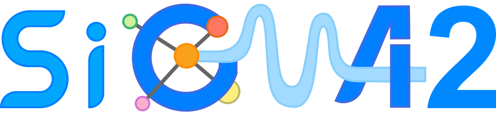

# SigmaCCS2

This is the code repo for the paper *SigmaCCS2: Collision Cross Section Prediction Using Molecular Topology and Geometry Information With Graph Neural Network*. We developed SigmaCCS2, which uses molecular and line graphs combined with Graph Neural Network to explicitly capture molecular topological and geometric information for CCS prediction. It is an improved version of SigmaCCS.

## Installation
**1.** Install [Anaconda](https://www.anaconda.com) for python 3.9.18.

**2.** Create environment and install the required packages.

- Open command line and create environment.
	```shell
  conda create --name SigmaCCS2 python=3.9.18
  conda activate SigmaCCS2
	```
- Clone the repository and enter.
	```shell
  git clone https://github.com/yuxuanliao/SigmaCCS2.git
  cd SigmaCCS2
	```
- Install the required packages in [`requirements/pip/requirements.txt`](requirements/pip/requirements.txt) with following commands.
  ```shell
  python -m pip install -r requirements/pip/requirements.txt
	```
- Or install the required packages by using the [`requirements/conda/environment.yml`](requirements/conda/environment.yml) with following commands.
  ```shell
  conda env create -f requirements/conda/environment.yaml
	```

## SigmaCCS2
The following files are in the [SigmaCCS2](SigmaCCS2) folder:
- [DataConstruction.py](SigmaCCS2/DataConstruction.py). for converting SMILES strings to molecular graph and line graph and using one-hot encoding to encode the adduct ion type.
- [ModelTraining.py](SigmaCCS2/ModelTraining.py). for model training.
- [ModelPrediction.py](SigmaCCS2/ModelPrediction.py). for defining the evaluation metrics and predicting the CCS values by SigmaCCS2.
- [Parameter.py](SigmaCCS2/Parameter.py). for saving relevant parameters including atom radius, atom mass, adduct set, and atoms set.

## Model training
Train the model based on your own training dataset with [SigmaCCS2_train](https://github.com/yuxuanliao/SigmaCCS2/blob/main/SigmaCCS2/ModelTraining.py#L65) function.
    
    SigmaCCS2_train(ifilepath, epochs, batchsize, savepath)

*Parameters*
- ifilepath : file path for storing the dataset to train the model
- epochs : the hyperparameter of the model
- batchsize : the hyperparameter of the model
- savepath : file path where the model is saved

## CCS Prediction
The CCS values of molecules is predicted by using the already trained SigmaCCS2 model with [SigmaCCS2_predict](https://github.com/yuxuanliao/SigmaCCS2/blob/main/SigmaCCS2/SigmaCCS2_predict.py#L37) function.

    SigmaCCS2_predict(ifilepath, mfilepath, ofilepath)

*Parameters*
- ifilepath : file path for storing the data of smiles and adduct, which needs to predict CCS values
- mfilepath : file path where the model is stored
- ofilepath : file path to save the predicted CCS values

## Usage
The example code for model training is included in the [train.ipynb](train.ipynb). By directly running [train.ipynb](SigmaCCS2/train.ipynb), user can train the model based on your own training dataset.

The example code for CCS prediction is included in the [predict.ipynb](predict.ipynb). By directly running [predict.ipynb](SigmaCCS2/predict.ipynb), user can use SigmaCCS2 to predict CCS values of small molecules.

## data and model
- [data](data) folder:
    - *[ExternalTestSet.csv](data/ExternalTestSet.csv)* (the external test set is used to evaluate the SigmaCCS2 approach)
    - *[ExternalTestSet-Prediction.csv](data/ExternalTestSet-Prediction.csv)* (the file generated by running [predict.ipynb](predict.ipynb))
    - *[F8196.csv](data/F8196.csv)* (the final dataset containing 8196 entries, out of which 90% are training samples and 10% are validation samples)

- [model](model) folder:
    - *[model.pt](model/model.pt)* (the optimized model)

## Web server
SigmaCCS2 is readily accessible via a web interface (https://huggingface.co/spaces/yuxuanliao/SigmaCCS2), which supports users in predicting the CCS values of molecules directly.

## Information of maintainers
- 232303012@csu.edu.cn
